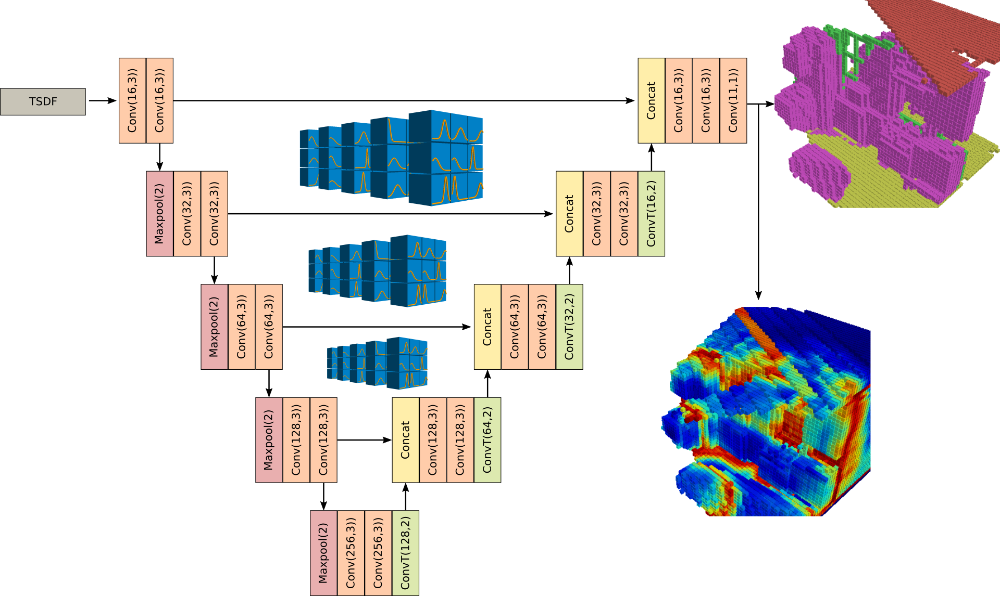

# BSSC-Net
CNN for Bayesian Semantic Scene Completion from a single depth image.
This is the code release for [our paper](https://ieeexplore.ieee.org/document/9412403)
from ICPR2020. Preprint is also available [at ArXiV](https://arxiv.org/abs/2010.08310).



## Introduction
This is a PyTorch implementation of a Bayesian Convolutional Neural Network (BCNN)
for Semantic Scene Completion on the SUNCG dataset.
Given a depth image represented as inverted depth ([see code](ssc/data/loader.py))
the network outputs a semantic segmentation and entropy score in 3D voxel format.

## Setup repository
```bash
git clone git@github.com:DavidGillsjo/bssc-net.git --recurse-submodules -j8
```

## Using the docker images
Check your Nvidia GPU model and adjust the variable `gpu_arch` accordingly in `docker/<module>/Dockerfile`.

**With elevated docker group permissions:**
```bash
cd docker/<module>
./build.sh
./run.sh
```

**Without:**
```bash
cd docker/<module>
sudo DUSER=<username> ./build.sh
sudo DHOME=/home/<username> ./run.sh
```

## Render and Build Dataset
[Download SUNCG dataset](https://sscnet.cs.princeton.edu/)

Download camera viewpoints:
```bash
wget http://pbrs.cs.princeton.edu/pbrs_release/data/camera_v2.zip
unzip camera_v2.zip -d ../camera
```

Build and run the `suncg_house3d` docker in the `docker` folder, see section [Using the docker images](#using-the-docker-images).
Alternatively install the dependencies yourself, see the [Dockerfile](docker/suncg_house3d/Dockerfile).

Go to repo root from docker:
```bash
cd /host_home/<your-repo-path>
```
the following code snippets assume your are in this directory.

[Build SUNCG Toolbox:](libs/SUNCGtoolbox/README.md)
```bash
cd libs/SUNCGtoolbox/gaps
make clean
make
```

[Build House3d:](libs/House3D/renderer/README.md)
```bash
cd libs/House3D/renderer
PYTHON_CONFIG=python3-config make -j
```

Set python path:
```bash
. init_env.sh
```

Execute rendering and grid generation script:
```bash
cd preprocessing
python3 generate_grids.py <suncg_dir> --nbr-proc 8 --model-blacklist blacklists/default.yaml --datasets <data_split_dir>/*mini.json
```
This will store results in `<suncg_dir>/scene_comp`, for more details see `python3 generate_grids.py --help`.
JSON dataset files are generated with `preprocessing/generate_data_splits.py`.
The splits used in the article can be found [here](https://lu.box.com/s/1gn7vruw33mhx8gh1blx8sgno6xxtsvv).

## Prerequisites for training/evaluating networks
Build and run the `bssc` docker in the `docker` folder, see section [Using the docker images](#using-the-docker-images).
Alternatively install the dependencies yourself, see the [Dockerfile](docker/bssc/Dockerfile).

## Train network
Depth images with corresponding voxel ground truth generated in previous section is required. For example placed in `/host_home/<suncg_dir>/scene_comp`.

Training can be monitored with tensorboard, for this you need to run:
```bash
cd ssc/scripts
./start_tensorboard.sh &
```

To start training, run:
```bash
cd ssc/scripts
python3 train.py /host_home/<suncg_dir>/scene_comp <train_json> --cfg ../cfg/train_bayesian.yaml --val <val_json>
```
See [configs](ssc/cfg) for options.

## Evaluate example image
To run the example, first download the pre-trained weights from [here](https://lu.box.com/s/kn9ug8fz7ox46zolrlrvnekvg4k1jxst).
Then run the evaluation script:
```bash
cd ssc/scripts
python3 eval.py ../../example ../../example/dataset.json bssc.tar --cfg ../cfg/eval_bayesian.yaml --result-dir <my_result_path>
```
For the SSC style net or run the following for Unet implementation:
```bash
cd ssc/scripts
python3 eval.py ../../example ../../example/dataset.json bssc_unet.tar --cfg ../cfg/eval_bayesian_unet.yaml --result-dir <my_result_path>
```

## Citation
```
@INPROCEEDINGS{bssc_net,
  author={Gillsjö, David and Åström, Kalle},
  booktitle={2020 25th International Conference on Pattern Recognition (ICPR)}, 
  title={In Depth Bayesian Semantic Scene Completion}, 
  year={2021},
  volume={},
  number={},
  pages={6335-6342},
  doi={10.1109/ICPR48806.2021.9412403}}
```

## Acknowledgment
This work is supported by [Wallenberg AI Autonomous Systems and Software Program](https://wasp-sweden.org/).
